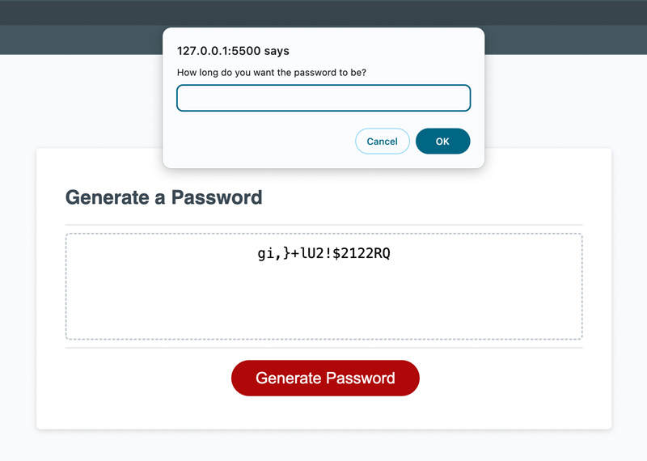

# Password Generator

This app utilizes JavaScript window prompt, confirm, and alert to guide a user through creating a totally random password. The user can opt to use lowercase letters, uppercase letters, numbers, or special characters, as well as choosing the length of the password.

## Lessons Learned

I solidified a lot of concepts for myself while developing the app, including declaring and calling variables and functions, scope, arrays, and randomization. I also learned and applied a switch case function, instead of using a lot of IF statements. Finally, getting out of the console log and into a user interface - although somewhat clunky with window popups - is an exciting development for me.

The password generator can be viewed here: [Password Generator](https://vikboyechko.github.io/password-generator/)